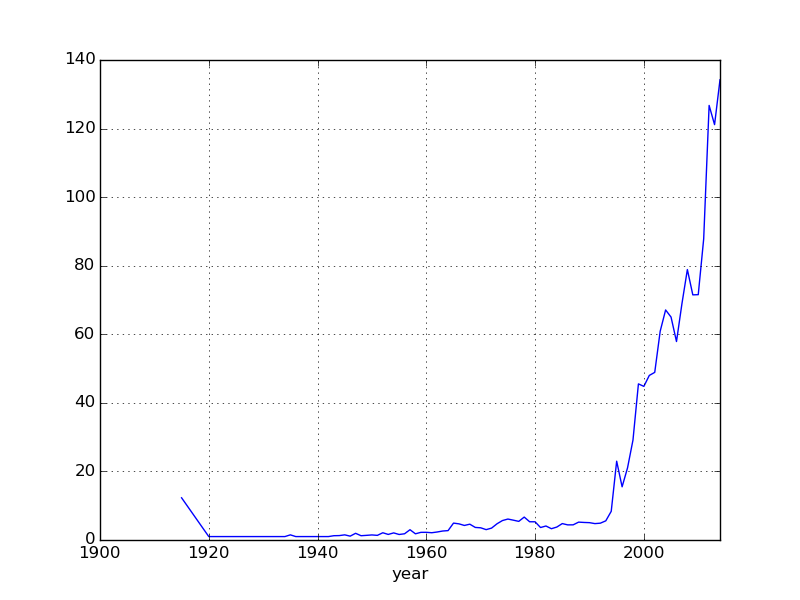
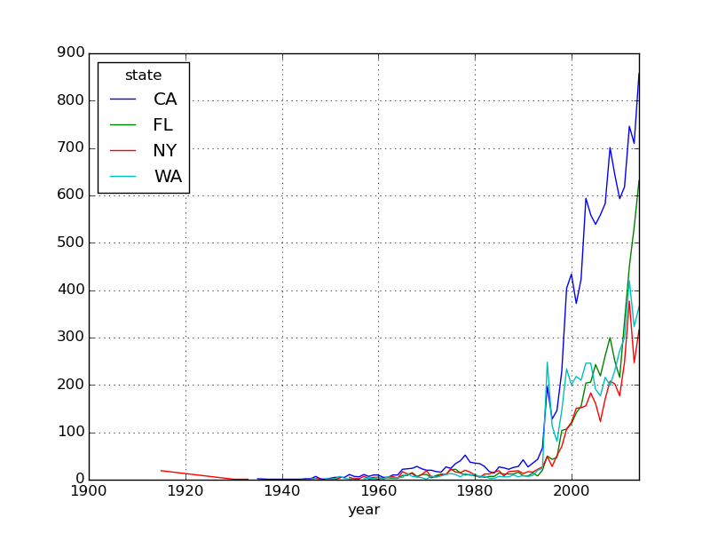
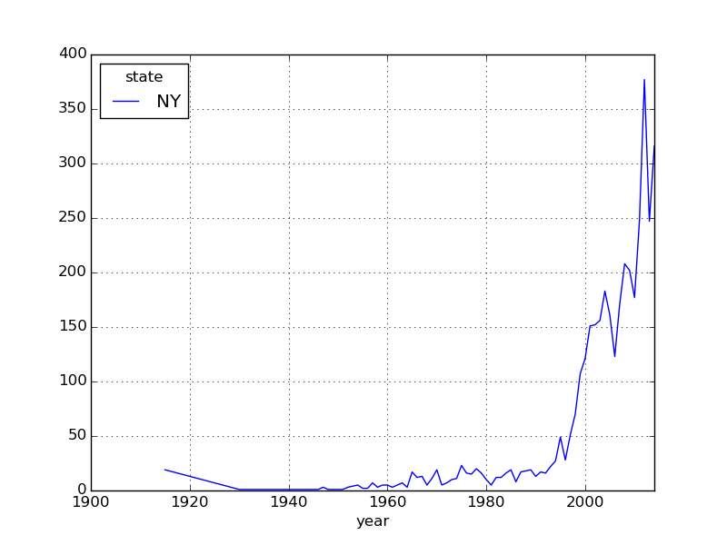

## Amazon Web Services

**Configuración de la máquina virtual**
```{r, eval=FALSE}
parallel --nonall --slf instancias "sudo apt-get install -y parallel"
parallel --nonall --slf instancias "sudo apt-get update"
parallel --nonall --slf instance "sudo apt-get update; sudo apt-get install -y r-base-core"
parallel --nonall --slf instance "sudo apt-get install -y libcurl4-gnutls-dev"
parallel --nonall --slf instance "sudo apt-get install -y r-cran-xml"
```

**Librerías**
```{r, eval=FALSE}
sudo R 
install.packages('rvest', repos="http://cran.us.r-project.org", dependencies=TRUE)
```

## Webscrapper
```{r, eval=FALSE}
parallel --nonall Rscript scrapping.r --slf instance "./scrapping.r"
```


```{r, eval=FALSE}
library(methods)
library(rvest)
base_url <- "http://www.nuforc.org/webreports/"

# Para obtener una página (en este caso el index)
ufo_reports_index <- html(paste0(base_url, "ndxevent.html"))

# Obtenemos las URLs de las páginas por día
daily_urls <- paste0(base_url, ufo_reports_index %>%
                       html_nodes(xpath = "//*/td[1]/*/a[contains(@href, 'ndxe')]")  %>%
                       html_attr("href")
)

tabla <- daily_urls[1] %>%
  html %>%
  html_nodes(xpath = '//*/table') %>%
  html_table()

a<-tabla[[1]]
for (i in 2:(length(daily_urls)-1)){
  tabla  <-  daily_urls[i] %>%
    html %>%
    html_nodes(xpath = '//*/table') %>%
    html_table()
  a<-rbind(a,tabla[[1]])
  write.table(a, file="/home/itam/proyectos/alumnos/aaronsapa1/proyecto1/ufo.txt",sep = "\t", col.names = TRUE)
}
```

## Bash

**¿Cuántas observaciones totales?**
```{r, eval=FALSE}
< ufo.txt wc -l
```
-96111



**¿Cuál es el top 5 de estados por año?**
```{r, eval=FALSE}
< ufo.txt \
      | cut -d$'\t' -f2,4 \
      | sed -r 's/[0-9]+\/[0-9]+\///' \
      | grep -E '"([A-Z]+)"' \
      | sed -r 's/([0-9]+):([0-5]?[0-9]):([0-5]?[0-9])//' \
      | sed -r 's/([01]?[0-9]|2[0-3]):[0-5][0-9]//' \
      | sort -t $'\t' -k 1 -k 2 \
      | uniq -c \
      | sort -nr \
      | grep -E '14' \
      | head -n 5
```

-851 "14 "  "CA"
-627 "14 "	"FL"
-373 "14 "	"PA"
-364 "14 "	"WA"
-315 "14 "	"NY"



**¿Cuál es la racha más larga en días de avistamientos en un estado?**

```{r, eval=FALSE}
find . -type f -name 'ufo.txt' parallel sed 1d \
  | cut -f1,3 \
	| grep --color=auto -E "[0-9]+[0-9]?/[0-9]+[0-9]?/[0-9]+[0-9]+" \
	| sed -E 's/( [0-9]+[0-9]+:[0-9]+[0-9]+)//' \
	| sed -E 's/[0-9]+[0-9]?\///' \
	| sed -E 's/\/[0-9]+[0-9]?//' \
	| grep "MI" \
	| uniq > prueba.csv
```
- California
- 41
**¿Cuál es la racha más larga en días de avistamientos en el país?**
- 225
**¿Cuál es el mes con más avistamientos? **
```{r, eval=FALSE}
< ufo.txt \
      | cut -d$'\t' -f2 \
      | sed -r 's/\/[0-9]+\/[0-9]+//' \
      | sed -r 's/([0-9]+):([0-5]?[0-9]):([0-5]?[0-9])//' \
      | sed -r 's/([01]?[0-9]|2[0-3]):[0-5][0-9]//' \
      | sed -r 's/ //' \
      | sort \
      | uniq -c \
      | sort -nr \
      | head -n 5
```
- Julio

**¿y el día?**
```{r, eval=FALSE}
< ufo.txt \
      | cut -d$'\t' -f2 \
      | sed -r 's/([0-9]+):([0-5]?[0-9]):([0-5]?[0-9])//' \
      | sed -r 's/([01]?[0-9]|2[0-3]):[0-5][0-9]//' \
      | sed -r 's/ //' \
      | sort \
      | uniq -c \
      | sort -nr \
      | head -n 5
```
-  4 de Julio del 2013

## Python

**Bash**

```{r, eval=FALSE, engine='bash'}
< ufo.txt cut -d$'\t' -f2,4   \
  | sed -r 's/([0-9]+):([0-5]?[0-9]):([0-5]?[0-9])//' \
    | sed -r 's/([01]?[0-9]|2[0-3]):[0-5][0-9]//' \
    | sed -r 's/^(19|20)//' \
    | tr -s  '\t' ',' \
    | sed -r 's/ //' \
    | sed 1d \
    | python porEstado.py NY
```
**Script de Python**
```{r, , engine='python',eval=FALSE}
import pandas as pd
import sys
import re
import numpy as np
es_num =r'([0-9]+)'
es_letra = r'"([A-Z]+)"'
def toletter(x):
  match = re.match(es_letra,x)
	aux = ''
	if match:
		aux = str(match.group(1))
	return aux
def toYear(x):
	match= re.match(es_num,x)
	if match:
		aux = int(match.group(1))
		if aux < 15:
			return 2000+aux
		else:
			return 1900+aux
def main():
	line = sys.stdin.readline()
	id = 0
	df = pd.DataFrame(columns= ["date","state","year"])
	while line:
		date,state = line.split(',')
		day,month,year = date.split("/")
		year = toYear(year)
		state = toletter(state)
		df.loc[id]=[date,state,year]
		line = sys.stdin.readline()
		id += 1

	df =df.dropna()
	dfFL_count =pd.DataFrame({'count' : df.groupby( [ 'state', 'year'] ).size()}).reset_index()
	xtics = np.arange(1900,2020,20)
	plot = dfFL_count.pivot_table("count", rows="year").plot(xticks=xtics)
	fig = plot.get_figure()
	fig.savefig("/home/itam/proyectos/alumnos/aaronsapa1/proyecto1/todos.png")

	FLindex=dfFL_count.index[dfFL_count.state=='CA']
	MAindex=dfFL_count.index[dfFL_count.state=='FL']
	TXindex=dfFL_count.index[dfFL_count.state=='WA']
	CAindex=dfFL_count.index[dfFL_count.state=='NY']
	segmentos = []
	segmentos.append(dfFL_count.ix[FLindex])
	segmentos.append(dfFL_count.ix[MAindex])
	segmentos.append(dfFL_count.ix[TXindex])
	segmentos.append(dfFL_count.ix[CAindex])
	states=pd.concat(segmentos, ignore_index=True)
	pivotTable=states.pivot_table('count',rows='year', cols='state')
	plot = pivotTable.plot(xticks=xtics)
	fig = plot.get_figure()
	fig.savefig("/home/itam/proyectos/alumnos/aaronsapa1/proyecto1/output.png")


	print(sys.argv[1])
	df =df[df.state==sys.argv[1]]
	dfFL_count =pd.DataFrame({'count' : df.groupby( [ 'state', 'year'] ).size()}).reset_index()
	pivotTable2=dfFL_count.pivot_table('count',rows='year', cols='state')
	plot =pivotTable2.plot(xticks=xtics)
	fig = plot.get_figure()
	fig.savefig("/home/itam/proyectos/alumnos/aaronsapa1/proyecto1/res.png")


if __name__ == '__main__':
	main()
```



