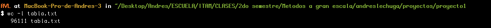
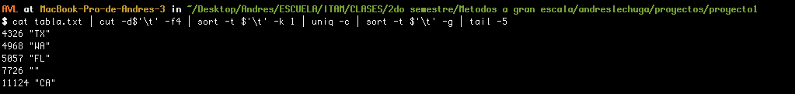
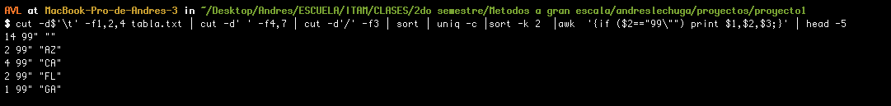
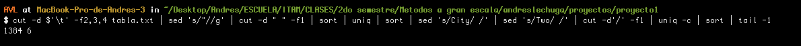

__¿Cuántas observaciones totales?__

$ wc -l tabla.txt



__¿Cuál es el top 5 de estados?__

$ cat tabla.txt | cut -d$'\t' -f4 | sort -t $'\t' -k 1 | uniq -c | sort -t $'\t' -g | tail -5



__¿Cuál es el top 5 de estados por año?__

$ cut -d$'\t' -f1,2,4 tabla.txt | cut -d' ' -f4,7 | cut -d'/' -f3 | sort | uniq -c |sort -k 2  |awk  '{if ($2=="99\"") print $1,$2,$3;}' | head -5



__¿Cuál es la racha más larga en días de avistamientos en un estado?__

Para esta pregunta se realizó un script en R el cual maneja los datos previamente guardados mediante el comando __"cat tabla.txt | cut -d$'\t' -f2,4 > fecha_estado.txt"__. Ahora, utilizando distitos paquetes y transformaciones. Es decir la idea para central poder describir las rachas consiste en convertir los datos a fechas, después hacerles un "lag" y analizar la diferencia en los días. Si la diferencia es de 1 dia, quiere decir que se tuvieron avistamientos en días consecutivos. Ahoria si consideramos todos los días consecutivos y los guardamos de acuerdo a la fecha podemos obtener las rachas y consultarlas de acuerso al criterio que seleccionemos en este caso, para estado y poseriormente para pais.


```{r}
library(dplyr)
library(tidyr)

df <- read.delim("~/Desktop/Andres/ESCUELA/ITAM/CLASES/2do semestre/Metodos a gran escala/andreslechuga/proyectos/proyecto1/fecha_estado2.txt", na.strings = "")

#dejamos a los que tienen ciudad
df <- df[complete.cases(df),]

#transformamos a formato de fecha y deparamos por ciudad
df <- df %>%
  separate(col=City, into=c("month","day","year","time"),
                 regex=" ",remove=F,extra="drop") %>%
  mutate(date = paste(month, day, year, sep = '/'),
         city = Shape,
        date = as.Date(date,format='%m/%d/%y'))%>%
  select(date,city)

#Aplicamos el lag y obtenemos las diferencias
data.lag <-df%>%
  group_by(city,date)%>%
  arrange(city, date)%>%
  summarise(reportes =n())%>%
  mutate(prev = lag(date),
        dif = (date -prev))

#agregamos y ordenamos por el acumulado 
data.lag$acumulado <- sequence(rle(as.character(data.lag$dif))$lengths)
data <-data.lag[with(data.lag, order(-acumulado)), ]

# Racha por estado
result <- data %>%
  group_by(city) %>%
  top_n(n=1)

head(result,10)

# Racha en todo el país.
head(data,10)

```


__¿Cuál es el mes con más avistamientos?__

$ cut -d $'\t' -f2,3,4 tabla.txt | sed 's/"//g' | cut -d " " -f1 | sort | uniq | sort | sed 's/City/ /' | sed 's/Two/ /' | cut -d'/' -f1 | uniq -c | sort | tail -1



__¿El día de la semana?__

Para esta pregunta se utiliza un script en R que utiliza la función __weekdays()__


```{r}
#!/usr/bin/env Rscript
#ca = commandArgs(trailingOnly=TRUE)
#ca = scan(file("stdin"), what = character(), sep = "\n", quiet=TRUE, na.strings = "");
library(dplyr)
library(tidyr)
df <- read.delim("~/Desktop/Andres/ESCUELA/ITAM/CLASES/2do semestre/Metodos a gran escala/andreslechuga/proyectos/proyecto1/fecha_estado.txt", na.strings = "")
df <- df[complete.cases(df),]
df <- as.data.frame(df)
df <- separate(df, col = df, into=c("date","state"), sep=" ",remove=F,extra="drop")
df$df <- NULL
fechas <- df$date
fechas <- as.Date(fechas,format='%m/%d/%y')
dias <- weekdays(fechas)
unique(dias)
dias <- as.factor(dias)
summary(dias)
```

Por lo que el día con más avistamientos es el sábado.


