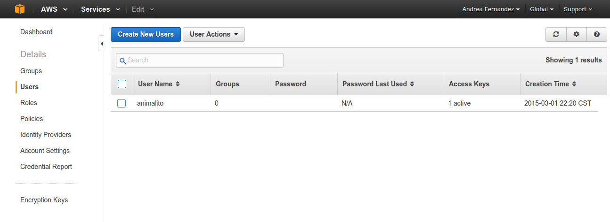
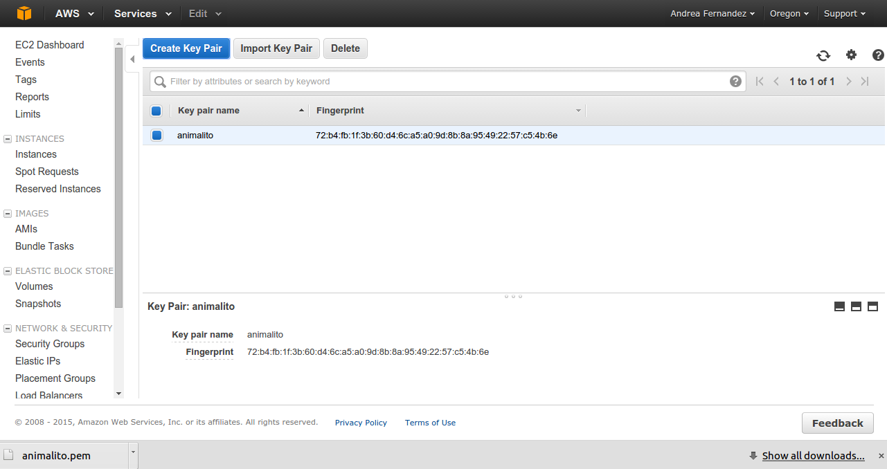
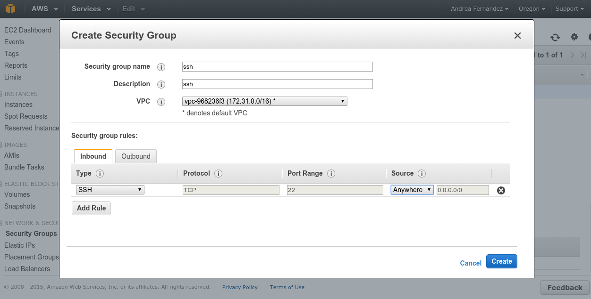
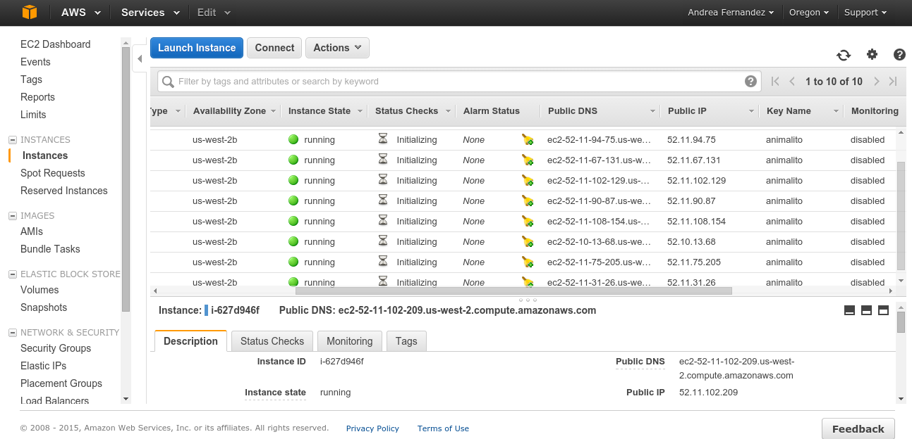

# Configurando instancias

1. Creas cuenta en [amazon](http://aws.amazon.com)
2. En la consola te vas a __Identity & Access Management__, creas un usuario.

3. Se descarga automaticamente un archivo con las credenciales y te vas a la consola y pones

```
aws configure
```
Te pide los datos en _credenciales.csv_ y pones de _Default region name [None]:_ us-west-2

4. Necesitas bajar un archivo __.pem__

En la consola de amazon, te metes a __EC2__, en _Key Pairs_ creas una.



5. Bajas el archivo __NombreDelKeyPair.pem__ y lo copias a tu carpeta __~/.ssh__

```
cp Downloads/animalito.pem .ssh 
echo Cambiamos los permisos de la llave para que solo el owner pueda verla
chmod 0400 .ssh/animalito.pem
```

6. En la consola de amazon en la seccion de __EC2__, creas un __Security Group__


7. Vas a necesitar mucha informacion de las cosas que ya creaste:

- __--image-id__ : La obtienes en la _consola de amazon> EC2>Instances>Launch Instance_. Dependiendo el tipo de maquina, eliges su id. Por ejemplo, para prender una Linux, lo que quiero es _ami-dfc39aef_.
- __count ##__: numero de instancias que quieres prender (rellena ## con el numero de maquinas que quieres)
- __instance-type__: tipo de instancia de la maquina de amazon que levantaras, por ejemplo _t2.micro_
- __--key-name__: ya hiciste una llave _.pem_, usala!
- __--security-group-ids__: cuando creaste el grupo de seguridad en el paso 6, puedes copiar el id del grupo que te aparece en la consola.

Con todo eso, llenas el siguiente comando para tu consola

```
aws ec2 run-instances --image-id ami-dfc39aef --count 10 --instance-type t2.micro --key-name animalito --security-group-ids sg-d26c43b7 --associate-public-ip-address
```

Revisa que todo funciono en la _consola de amazon > EC2 > Instances_



Debes ver tus 10 maquinitas prendidas. Ahora lo que necesitamos son los identificadores de las maquinas. Es decir, ya sea _Public DNS_ o _Public IP_.

Para eso, escribes en tu consola

```
aws ec2 describe-instances --query 'Reservations[*].Instances[*].PublicDnsName' --output text \
    | sed 's/\t/\n/g' > data/instancias.txt
```

Y listo! Tienes un archivin con los _Public DNS_ de las maquinas que prendiste.

8. Por ultimo, configuramos las contrasenas para que no nos la pida 

__Opcion 1__: Creas esl archivo _nano ~/.ssh/config_ y pones:

```
Host *
     User ubuntu
     IdentityFile ~/.ssh/animalito.pem
```

__Opcion 2__: Pones en tu consola

```
ssh-add ~/.ssh/animalito.pem
```

