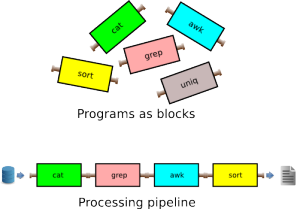

Big data :: Lecture 2
========================================================
author: Adolfo De Unánue T.
date: 14 de Enero, 2015
font-import: http://fonts.googleapis.com/css?family=Risque
font-family: 'Risque'
css: lecture_2.css


Preguntas
========================================================
- ¿Sus datos son estáticos o dinámicos?
- ¿Dónde los voy a almacenar?
  - Base de datos, web, etc
  - Infraestructura como servicio (IaaS)
- ¿En que formato?
- ¿Cómo presentamos los datos?
  - Visualización, descarga, acceso, etc.
- ¿Estoy en **big data**?
  - Memoria.
  - Columnas, no sólo renglones.

IaaS
=======================================================
type: sub-section


IaaS
========================================================

- Ventajas
  - Por el costo de un *hardware* caro, es posible de tener mucho más poder en la nube.
  - Es posible sólo pagar por el uso.
  - Escala muy bien, mucho mejor que comprar cada vez más espacio, CPU, etc.

- Desventajas
  - La red es *muy lenta*.
  - De verdad, es **muy lenta**.
  - `25 Gb a 5.3 Mb/s -> 11h ` `:(`


Formatos
=======================================================
type: sub-section


CSV
========================================================
- *Comma separated values*
- Sirve para datos que se pueden acomodar en una tabla.
- Es excelente para acceso *secuencial* a los datos.
  - Cuando el archivo es muy grande, considerar procesar *bulk* y no línea por línea.
- Se puede partir en pedacitos y sigue funcionando.
- No sirve para datos que no estén en formato rectangular.
- No se describe así misma...
  - Y no es estándar su creación.
- Separadores, *headers*, `encoding`, escapes raros, etc...

CSV
========================================================

- Yo recomiendo usar como separador el *pipe*: `|`.
  - Terminación `psv`.
  - El problema es que las personas en Office en Mac, probablemente sufran...
- Poner siempre el `header`.

CSV
========================================================
- En `R`


```r
  write.table(datos, file="algun_archivo.psv", quote=TRUE, na="NA", dec=".", row.names=FALSE, col.names=TRUE, sep="|")
```

CSV
========================================================

- En `python`

<small>
```{python, eval=FALSE}
def write_psv(file_name, dic, header):
    csv.register_dialect('psv', delimiter='|', quoting=csv.QUOTE_ALL) # Dialecto PSV
    with open(os.path.relpath('../data/'+ file_name), 'a') as csv_output:
        csvWriter = csv.DictWriter(f=csv_output, extrasaction='raise', fieldnames=header, dialect='psv')
        csvWriter.writerow(dic)
```
</small>

CSV
========================================================
- En `PostgreSQL` (desde `psql`)

```{sql}
\copy (select * from foo) to '/algun_archivo.psv' with header csv delimiter '|'
```

XML
========================================================
- *eXtensible Markup Languague*
- Los datos se validan contra la estructura.
- La descripción de los datos es parte de los datos.
  - i.e. tienen un *esquema*.
- Súper *verbose*.
- Es posible convertir a cualquier tipo de archivo desde aquí.
- Recorrerlo puede ser doloroso.
  - Ni siquiera voy a poner un ejemplo
- Usar como **fuente de la verdad**.
  - Interoperación

JSON
============================================================
- *JavaScript Object Notation*
- Es Javascript (en realidad es **Javascript**)
- Súper popular entre los desarrolladores.
- Más rápido que *parsear* que un `XML`.
- Se puede accesar secuencialmente.
- *Verbose*
- No tiene validación.
- Fácil de *subir* a bases de datos **no-relacionales**.


Ejemplos
==============================================================

- CSV

<small>
`nombre, apellido, fecha`

`Adolfo, De Unanue, 04/02/1978`
</small>

Ejemplos
=========================================================
- XML

<small>
```{xml}
<xml>
<profesor>
  <nombre>
    <nombre> Adolfo </nombre>
    <apellidos>
      <paterno>De Unánue</paterno>
      <materno>Tiscareño</materno>
    </apellidos>
  </nombre>
  <nacimiento>
    <fecha>04/02/1978</fecha>
    <lugar></lugar>
  </nacimiento>
</profesor>
</xml>
```
</small>

Ejemplo
============================================================

- JSON

<small>
```{json}
  {
  "nombre": Adolfo De Unánue
  "fecha_nacimiento": 04/02/1978
  }
```
</small>

Serialización
=========================================================
- Moverlos por la red es terrible si son varios `Gb`
  - Comprimirlos también puede ser costoso en tiempo...
- **Apache Thrift**
  - Original de Facebook.
  - Archivo de metadatos -> Generador de código -> Servidor que se encarga de la serialización.
  - Otro proyecto similar es *Google Protocol Buffer*
- **Apache Avro**
  - Autodescriptivo como `JSON`, pero no incorpora la descripción en cada elemento.
  - Soporta nativamente la compresión.


Otros consejos
=========================================================
- Encoding: **UTF-8**
  - Verifica tu editor de texto, proceso, etc.
- Transformación de archivos:
  - **Apache Hadoop**


Herramientas
=======================================================
type: sub-section

Consola
=======================================================
type: sub-section

Bash / Zsh
=======================================================
- En Ubuntu / Debian etc.

```
sudo apt-get install zsh`
```

- Instalar `Oh-my-zsh`

```
curl -L https://raw.github.com/robbyrussell/oh-my-zsh/master/tools/install.sh | sh
```

- Establecer `zsh` como default

```
chsh -s $(which zsh)
```


Navegar
=======================================================

- `Ctrl + a` Inicio de la línea
- `Ctrl + e` Fin de la línea
- `Ctrl + r` Buscar hacia atrás
  - Elimina el *flechita arriba*
- `Ctrl + b` / `Alt + b`
- `Ctrl + f` / `Alt + f`
- `Ctrl + k` - Elimina el resto de la línea
- `Ctrl + d` - Cierra la terminal
- `Ctrl + z` - Manda a *background*
- `Ctrl + c` - Intenta cancelar


Git & Github
=======================================================
type: sub-section


¿Por qué un control de versiones?
=======================================================
- Sincronizar cambios con tus compañeros de trabajo.
- Respaldos regulares (muy regulares) de tu trabajo.
  - Enviar correros electrónicos no está bien, no escala, no es *cool*, punto.
- *Configuration Management*  líneas de desarrollo en paralelo.
  - Eso no lo veremos en este curso, pero vale la pena averiguar.

Configuración básica
========================================================

```
$ git config --global user.name "Nombre Apellido"
$ git config --global user.email "correo@buzon.com"

```


Primero: Fork
=======================================================
type: prompt


**DEMO EN EL NAVEGADOR**


Flujo
========================================================


Ejemplo
============================================================
Luego de hacer el `fork`
```
git clone https://github.com/nanounanue/itam-big-data.git
cd itam-big-data
touch uno.txt
touch dos.txt
git add .
git status
git commit -m "Archivos iniciales"
echo "Hola" > uno.txt
echo "Adios" > dos.txt
git diff uno.txt
git status
git add uno.txt
git commit -m "Agregamos un hola"
```

Ejemplo (Continuación)
=========================================================
```
git status
git add dos.txt
git commit -m "Agregamos un adios"
git status
git push
```

Luego hacemos un `pull request` en el navegador (si es que ya vamos a entregar la tarea).

Ejemplo (Continuación)
==========================================================

Por último, para sincronizar con los cambios en el `fork` principal
```{bash}

> git remote -v # Vemos que remotes tenemos ligados
# Agregamos el repo de la clase
> git remote add nanounanue https://github.com/nanounanue/itam-big-data.git
> git remote -v
> git pull nanounanue master # Para "jalar" los cambios del fork principal
> git push # Para subir los cambios a su fork
```

Unix tools para big data
=======================================================
type: sub-section

Outline
============================================================
- Pipes y flujos
- `wc`
- `head`, `tail`
- `split`, `cat`
- `cut`
- `uniq`, `sort`
- Expresiones regulares `regex`
- `grep`
- `awk`
- `sed`
- `GNU parallel`

¿Por qué?
==================================================================

En muchas ocasiones, se verán en la necesidad de responder muy rápido y
en una etapa muy temprana del proceso de *big data* . Las peticiones
regularmente serán cosas muy sencillas, como estadística univariable y es
aquí donde es posible responder con las herramientas mágicas de UNIX.


Lego: Idea poderosa
===================================================================



Datos para jugar
==================================================================


Datos para jugar
==================================================================
- Para los siguientes ejemplos trabajaremos con los archivos
encontrados en `data`.
- Estos datos representan la lista de pasajeros del Titanic y si
sobrevivieron o no.
- Se incluyen dos archivos de datos `train.csv` y `test.csv`.
- La descripci ́on de las variables est ́a en el archivo `descripción.txt`.

Pipes y flujos
===============================================================

- `|` (pipe) “Entuba” la salida de un comando al siguiente
- `>`,`>>`, Redirecciona la salida de los comandos a un sumidero.

```
ls >> prueba.dat
```

Pipes y flujos
===============================================================

- `<` Redirecciona desde el archivo
```
sort < prueba.dat # A la línea de comandos acomoda con sort,
sort < prueba.dat > prueba_sort.dat # Guardar el sort a un archivo.
```

- `&&` es un AND, sólo ejecuta el comando que sigue a `&&` si el
primero es exitoso.
```
> ls && echo "Hola"
> lss && echo "Hola"
```

wc
================================================================

- `wc` significa *word count*
  - Cuenta palabras,renglones, bytes, etc.
- Es un buen momento para aprender que existe un manual.
  - `man wc`
- En nuestro caso nos interesa la bandera `-l` la cual sirve para contar líneas.

wc
====================================================================

```
> cd data
> wc -l train.csv
892 train csv
> wc -l *.csv
419 test.csv
892 train.csv
1311 total
```

head, tail
===================================================================
- `head` y `tail` sirven para explorar visualmente las primeras diez
(default) o las últimas diez (default) renglones del archivo,
respectivamente.


```
> cd data
> head train.csv
> tail -3 train.csv
```


split, cat
===================================================================
- `cat` concatena archivos y/o imprime al `stdout`

```
> echo 'Hola mundo' >> test
> echo 'Adios mundo cruel' >> test
> cat test
...
> rm test
> cd data
> cat train.csv test.csv  > titanic.csv
> wc -l titanic.csv
```

split, cat
===================================================================

- `split` hace la función contraria, divide archivos.
- Puede hacerlo por tamaño (bytes, `-b`) o por líneas (`-l`).

```
> split -l 500 titanic.csv
> wc -l titanic.csv
```

cut
===================================================================
- Con `cut` podemos dividir el archivo pero por columnas.
- Donde columnas puede estar definido como campo (`-f`), en
conjunción con (`-d`), carácter (`-c`) o bytes (`-b`).
- En este curso nos interesa partir por campo.

```
$ echo "Adolfo|1978|Físico" >> prueba.psv
echo "Patty|1984|Abogada" >> prueba.psv
cut -d’|’ -f1 prueba.psv
cut -d’|’ -f1,3 prueba.psv
cut -d’|’ -f1-3 prueba.psv
```

Pregunta
==================================================================
type: prompt

Pregunta: ¿Qué pasa con los datos de Titanic? Por ejemplo: Quisiera
las columnas 2, 4, 6 ó si quiero las columnas de sexo, supervivencia, edad
y clase.

```
> head train.csv | cut -d’,’ -f2,4,6
...
> head train.csv | cut -d’,’ -f4,1,5,2
...

```
¿Ven el problema? Para resolver esto, necesitamos comandos más
poderosos... pero antes dos comando más :)

uniq y sort
===============================================================

- `uniq` Identifica aquellos renglones consecutivos que son iguales.
- `uniq` puede contar (`-c`), eliminar (`-u`), imprimir sólo las duplicadas
(`-d`), etc.
- sort Ordena el archivo, es muy poderoso, puede ordenar por
columnas (`-k`), usar ordenamiento numérico (`-g`, `-h`, `-n`), mes
(`-M`), random (`-r`) etc.

```
sort -t "," -k 2 -k 1 -n train.csv
```

uniq y sort
===============================================================

- Combinados podemos tener un `group by`:

```
> cat train.csv | cut -d, -f1,2 | sort -t "," -k 2 -k 1 -n | uniq -c
```

Expresiones regulares
================================================================

- Broma

**Q:** - What did one regular expression say to another?

**A:** `.*`


Expresiones regulares
================================================================
*In computing, regular expressions provide a concise and flexible means for
identifying strings of text of interest, such as particular characters, words,
or patterns of characters. Regular expressions (abbreviated as regex or
regexp, with plural forms regexes, regexps, or regexen) are written in a
formal language that can be interpreted by a regular expression processor,
a program that either serves as a parser generator or examines text and
identifies parts that match the provided specification.*

`Wikipedia: Regular Expressions`

Regexp: Básicos
===================================================================
- Hay varios tipos POSIX, Perl, PHP, GNU/Emacs, etc.
  -Aquí veremos `POSIX`.

- Pensar en patrones (*patterns*).
- Operadores básicos
  - OR, `gato|gata` hará match con gato o gata.
  - Agrupamiento o precedencia de operadores, `gat(a|o)` tiene el mismo
significado que `gato|gata`.
  - Cuantificadores, `?` 0 o 1, `+` uno o más, `*` cero o más.


Regexp: Básicos
========================================================================

- Expresiones básicas
  - `.` Cualquier carácter.
  - `[ ]` Cualquier carácter incluido en los corchetes, e.g. `[xyz]`, `[a-zA-Z0-9-]`.
  - `[^ ]` Cualquier car ́acter individual que n esté en los corchetes, e.g.
`[^abc]`. También puede indicar inicio de líınea (fuera de los corchetes.).

Regexp: Básicos
========================================================================

- `\( \)` ó `( )` crea una subexpresión que luego puede ser invocada con
`\n` donde `n` es el número de la subexpresión.

  -`{m,n}` Repite lo anterior un número de al menos `m` veces pero no mayor
a `n` veces.
  - `\b` representa el límite de palabra.


Regexp: Ejemplos
=================================================================

- username: `[a-z0-9 -]{3,16}`�
- contraseña: `[a-z0-9 -]{6,18}`

- IP address:

```
( 25[0-5]|2[0-4][0-9]|[01]?[0-9][0-9]?_)3(25[0-5]|2[0-4][0-9]|[01]?[0-9][0-9]?)
```

Regexp: Ejercicios
=========================================================

- fecha (dd/mm/yyyy): ???
- email (adolfo@itam.edu) : ???
- URL (http://gmail.com): ???


Regexp: Expresiones de caracteres
========================================================
- `[:digit:]` Dígitos del 0 al 9.
- `[:alnum:]` Cualquier caracter alfanumérico 0 al 9 OR A a la Z OR a
a la z.
- `[:alpha:]` Caracter alfabético A a la Z OR a a la z.
- `[:blank:]` Espacio  o TAB únicamente.


Regexp: Tarea 1
========================================================
type: alert

- ¿Cómo reconocemos el nombre en la fuente de datos de titanic?
- Traducir la broma

grep
========================================================
type:exclaim

`grep` nos permite buscar líneas que tengan un patrón específico

```
> grep "Mrs\." train.csv # ¿Cuántas señoras hay?
> grep "Miss\." train.csv # ¿Cuántas señoritas?
> grep "Mr\." train.csv # ¿Hombres?
> grep -v "Mr\." train.csv # ¿Mujeres?
#  ¿Coincide si lo hacemos por sexo?
> grep -E "John|James" train.csv # Mmmm, traemos de más
> grep -E "John|James" | grep -v -E "Johnston|Johnson"
> grep -c -o -E "John|James" train.csv #Ejecuta una bandera a la vez
> grep -o -E "John|James" train.csv | sort | uniq -c
> grep -o -E "\bJohn\b|\bJames\b" train.csv | sort | uniq -c #Delimitador de palabra
> grep "^[0-9]\{1,5\}$" numbers.txt # 1 o 6
> grep "^[0-9]\{5\}$" numbers.txt # Exactamente 5
> grep "[0-9]\{5,\}" numbers.txt # Más de 5
> grep "\(aeiou]\).\1" names.txt # Vocal caracter Misma vocal
> egrep -o "(javier|romina|andrea)" names.txt | sort | uniq -c | sort -r
```

awk
==========================================================
- `awk` es un lenguaje de programación muy completo, orientado a archivos de texto que vengan en columnas.
- Un programa de `awk` consiste en una secuencia de enunciados del tipo patrón-acción:

```
  pattern { action statement }
```
- Si hay varios se separan con `;`

```
[pattern] {[command1]; [command2]; [command3]}
```

awk
==========================================================
- Keywords: `BEGIN , END, [op1] ~` `[regular expression]`, operadores booleanos como en `C`.

- Variables especiales:
    - `$1, $2, $3, ...` – Valores de las columnas
    - `$0` – toda la línea
    - `FS` – separador de entrada
      data.
    - `OFS` – separador de salida
    - `NR` – número de la línea actual
    - `NF` – número de campos en la línea (record)

awk: sintáxis
=========================================================
type:exclaim

```
awk '/search pattern1/ {Actions}
     /search pattern2/ {Actions}' file
```

awk: Ejemplos
=========================================================
```
> awk 'END { print NR }'  train.csv # Lo mismo que wc -l
> awk 'BEGIN{ FS = "|" }; { if(NF != 22){ print >> "train_fixme.csv"} \
else { print >> "train_fixed.csv" } }' train.csv
# Limpia el archivo con columnas de más
> awk '{ print NF ":" $0 }' train.csv
> awk '{ $2 = ""; print }'
> awk 'NF > 4' train.csv # Imprime las líneas que tengan más de cuatro campos
> awk 'BEGIN{ FS = "," }; {sum += $2} END {print sum}' train.csv
# Suma de una columna (aunque aquí no tiene mucho sentido)
> awk '{sum7+=$7; sum8+=$8;mul+=$7*$8} END {print sum7/NR,sum8/NR,mul/NR}' train.csv
# Promedios de varias columnas
> awk '/Beth/ { n++ }; END { print n+0 }' train.csv
> awk '$1 > max { max=$1; maxline=$0 }; END { print max, maxline }'train.csv
# Imprime el máximo del campo $1
> awk '{ sub(/foo/,"bar"); print }' train.csv
> awk '{ gsub(/foo/,"bar"); print }' train.csv
> awk '/baz/ { gsub(/foo/, "bar") }; { print }' train.csv
> awk '!/baz/ { gsub(/foo/, "bar") }; { print }' train.csv
> awk 'a != $0; { a = $0 }' # Como uniq
> awk '!a[$0]++' # Remueve duplicados que no sean consecutivos
> awk '$4 ~/Technology/' employee.txt
> awk 'BEGIN { count=0;}
$3 ~ /John/ { count++; }
END { print "Número de Johns en el Titanic =",count;}' train.csv
```

awk: Más sintaxis
=========================================================
type:exclaim

```
awk '
BEGIN { Actions}
{ACTION} # Action for everyline in a file
END { Actions }
# is for comments in Awk
' file
```

awk: mean, max, min
=========================================================

```
> awk '{FS="|"}{if(min==""){min=max=$1}; if($1>max) {max=$1};if($1<min) {min=$1}; total+=$1; count+=1} END \
{print "mean = " total/count,"min = " min, "max = " max}' data.txt
```

awk: Mediana
==========================================================

```
$ gawk -v max=128 '
    function median(c,v,  j) {
       asort(v,j);
       if (c % 2) return j[(c+1)/2];
       else return (j[c/2+1]+j[c/2])/2.0;
    }

    {
       count++;
       values[count]=$1;
       if (count >= max) {
         print  median(count,values); count=0;
       }
    }

    END {
       print  "median = " median(count,values);
    }' data.txt
```

awk: Desviación estándar
=========================================================

```
awk '{sum+=$1; sumsq+=$1*$1;}
END {print "stdev = " sqrt(sumsq/NR - (sum/NR)**2);}'
data.txt
```

awk
=========================================================

¿Qué pasa cuando hay muchas columnas?

```
awk -F "|" '
{ for (i=1; i<=NF; ++i) sum[i] += $i; j=NF }
END { for (i=1; i <= j; ++i) printf "%s ", sum[i]; printf "\n"; }
' data2.txt
```

sed
=========================================================

- `sed` significa *stream editor* . Permite editar archivos de manera automática.
- El comando tiene cuatro *espacios*
  - Flujo de entrada
  - Patrón
  - Búfer
  - Flujo de salida
- Entonces, `sed` lee el *flujo de entrada* hasta que encuentra `\n`. Lo copia al *espacio patrón*, y es ahí donde se realizan las operaciones con los datos. El *búfer* está para su uso, pero es opcional, es un búfer, vamos. Y finalmente copia al *flujo de salida*.

sed
==========================================================
```
> sed 's/foo/bar/' data3.txt   # Sustituye foo por bar
> sed -n 's/foo/bar/' data3.txt # Lo mismo pero no imprime a la salida
> sed -n 's/foo/bar/; p' data3.txt # Lo mismo pero el comando "p", imprime
> sed -n 's/foo/bar/' -e p data3.txt # Si no queremos separar por espacios
> sed '3s/foo/bar/'  data3.txt # Sólo la tercera linea
> sed '3!s/foo/bar/'  data3.txt # Excluye la tercera línea
> sed '2,3s/foo/bar/' data3.txt # Con rango
> sed -n '2,3p' data3.txt  # Imprime sólo las líneas de la 2 a la 3
> sed -n '$p' # Imprime la última línea
> sed '/abc/,/-foo-/d' data3.txt # Elimina todas las líneas entre "abc" y "-foo-"
> sed '/123/s/foo/bar/g'  data3.txt
# Sustituye globalmente "foo" por "bar" en las líneas que tengan 123
> sed 1d data2.txt # Elimina la primera línea del archivo
> sed -i 1d data2.txt  # Elimina la primera línea del archivo de manera interactiva
```


Otros comandos útiles
==========================================================

- `file -i` Provee información sobre el archivo en cuestion

```
> file -i train.csv
train.csv: text/plain; charset=us-ascii
```

- `iconv` Convierte entre encodings, charsets etc.

```
> iconv -f iso-8859-1 -t utf-8 train.csv > train_utf8.csv
```

Otros comandos útiles
==========================================================
`od` Muestra el archivo en octal y otros formatos, en particular la bandera `-bc`
lo muestra en octal seguido con su representación ascii. Esto sirve para identificar separadores raros.

```
> od -bc train.csv  | head -4
0000000 163 165 162 166 151 166 145 144 054 160 143 154 141 163 163 054
          s   u   r   v   i   v   e   d   ,   p   c   l   a   s   s   ,
0000020 156 141 155 145 054 163 145 170 054 141 147 145 054 163 151 142
          n   a   m   e   ,   s   e   x   ,   a   g   e   ,   s   i   b
```

Utilerías
==========================================================
- `screen` o `tmux` para tener varias sesiones abiertas en una terminal.
  - En particular muy útiles para dejar corriendo procesos en el servidor.

- `bg` ó  `&` para mandar procesos al *background*

```{python}
python -m SimpleHTTPServer 8008 &
# Ejecuto un servidor HTTP
```

- `fg` para traerlos a la vida de nuevo.

Bash programming
========================================================
- *loops*

```
for var in `comando`
do
instrucción
instrucción
...
done
```

- Condicionales

`if TEST-COMMANDS; then CONSEQUENT-COMMANDS; fi`


Bash programming
========================================================
- Al final hay que poner esto en un archivo, ponerlo a correr e irnos
  a pensar...
- Para cualquier programa *script* es importante que la primera línea del archivo le diga a bash que comando usar para ejecutarlo.
- Esta linea se conoce como *shebang* y se representa por `#!` seguido de la ruta al ejecutable. eg. `#!/usr/bin/python` cambia la ejecución de

```
> python ejemplo.py
```
a
```
> ./ejemplo.py
```

GNU parallel
==========================================================

- Todo esto está muy bien, pero ...
  - ¿Cómo aprovecho todos los `cores` (o `procesadores` si son afortunados) de mi máquina?

- Instalación

```
wget http://ftp.jaist.ac.jp/pub/GNU/parallel/parallel-latest.tar.bz2
tar -xjf parallel-latest.tar.bz2
cd parallel-20131022/
./configure --prefix=`pwd` && make && make install
```

GNU parallel: Ejemplos sencillos
==========================================================
- Pasando parámetros

`> parallel echo ::: A B C`

- Si el archivo `archivos_a_procesar` contiene una lista de archivos

`> parallel -a archivos_a_procesar gzip`

- También puede usar el `STDIN`

`> ls *.gz | parallel echo`

GNU parallel: Ejemplos sencillos
==========================================================
- Vayamos a  la carpeta  `data` y comprimamos los archivos

`> ls *.txt | parallel gzip -1`

(Si quisieras descomprimir `> ls *.gz | parallel gunzip -1`)

- Convirtamos a `bz2`

`> ls *.gz | parallel -j+0 --eta 'zcat {} | bzip2 -9 > {.}.bz2'`

`-j+0` indica un `job` por `core`

GNU parallel: Progreso
==========================================================

`> parallel --progress sleep ::: 10 3 2 2 1 3 3 2 10`

`> parallel --eta sleep ::: 10 3 2 2 1 3 3 2 10`


GNU parallel: Controlando la red
=========================================================

```
ls *.gz |  time /usr/local/bin/parallel -j+0 --eta -S192.168.0.101,: --transfer --return {.}.bz2 --cleanup 'zcat {} | bzip2 -9 >{.}.bz2'
```

- `-S` lista de servidores (`:` es `localhost`).
  - require que las máquinas tengan configurado ssh sin password).

- `--transfer` mover los archivos al servidor.

- `--return` regresar los archivos a la máquina que está ejecutando.

- `--cleanup` eliminar los archivos generados de las máquinas remotas.

GNU parallel: Archivotes
========================================================
- Carpeta `parallel`, el archivo `1000000.txt` tiene `cat 1000000.txt | wc -l` líneas.

- Podemos procesarlo por pedazos (será muy útil a la hora de cargar en PostgreSQL)

`> cat 1000000.txt | parallel --pipe wc -l`

- Podemos cambiar el `blocksize`

`> cat 1000000.txt | parallel --pipe --block 3M wc -l`

(por default corta los bloques en `\n`)


GNU parallel: Tutorial
=========================================================

Siempre es bueno tener esto a la mano:

`http://www.gnu.org/software/parallel/parallel_tutorial.html`


Unos trucos (vía @climagic)
=========================================================
type:exclaim

```
git log --author=$USER --format="- %B" --since=-7days --reverse | mail -s "What I've done this week" boss@company\.com
```

```
cat /dev/urandom | hexdump -C | grep "ca fe"
```

```
for t in "Wake up" "The Matrix has you" "Follow the white rabbit" "Knock, knock";do pv -qL10 <<<$'\e[2J'$'\e[32m'$t$'\e[37m';sleep 5;done
```


Finalmente...
=========================================================
type:exclaim
```
Computers are supposed to do the work for us. If you're doing most of the work for the computer,
then you've lost your way.

@climagic
```

Tarea 2
==========================================================
type: alert
- ¿Cuántos nombres diferentes hay? ¿Cuál es su frecuencia?
- Modificar los ejemplos de `awk` de promedios, máximo, mínimo y desviación estándar para que se calculen con varias columnas
- Datos Titanic:
  - Generar un reporte con estadística univariante de los datos del titanic
  - Conteos (para categóricas), promedios, máximos, mínimos, faltantes, errores del archivo.
  - Ejecutar dos reportes en dos máquinas diferentes (usando `GNU parallel`): uno para `test` y otro para `train`
